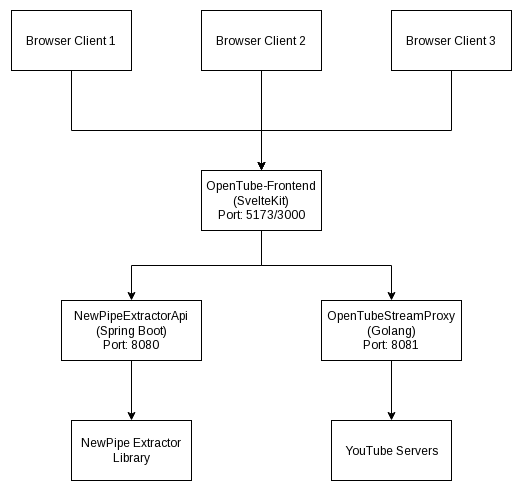

<div align="center">


# OpenTube

**A self-hostable YouTube frontend — private, ad-free, and yours.**

[](LICENSE)
[](https://kit.svelte.dev)
[](https://spring.io/projects/spring-boot)
[](https://golang.org)
[](https://www.docker.com)

OpenTube uses the [NewPipe Extractor](https://github.com/TeamNewPipe/NewPipeExtractor) to access YouTube content without official APIs — no tracking, no ads, complete control over your data.

</div>

---

## ✨ Features

- 🔒 **Privacy-first** — No tracking, no ads, no Google APIs
- 🏠 **Self-hostable** — Run locally or on your own server
- ⚡ **Performant** — DASH manifest generation for optimized video streaming
- 🧩 **Modular** — Clean microservices architecture, easy to extend

---

## 🏗️ Architecture

<div align="center">

</div>

---

## 🚀 Deployment

Choose the deployment option that suits your setup:

| Option | Description | Guide |
|--------|-------------|-------|
| 💻 **Local Development** | Run everything on your own machine — ideal for development and personal use | [Local Deployment Guide](docs/DEPLOYMENT.md) |
| 🖥️ **Self-Hosted Server** | Deploy to your home server or a VPS for persistent, always-on access | [Server Deployment Guide](docs/SERVER_DEPLOYMENT.md) |

### Quick Start (Local)

```bash
# Clone the repository (includes submodules)
git clone --recursive-submodules https://github.com/VimVoyager/OpenTube.git
cd OpenTube
```

```bash
# Terminal 1 — Backend API
cd NewPipeExtractorApi && mvn spring-boot:run

# Terminal 2 — Stream Proxy
go run main.go

# Terminal 3 — Frontend
npm run dev
```

| Service  | URL |
|----------|-----|
| Frontend | http://localhost:5173 |
| API      | http://localhost:8080 |
| Proxy    | http://localhost:8081 |

---

## 🛠️ Tech Stack

<div align="center">

| Component | Technology | Purpose |
|-----------|-----------|---------|
|  | SvelteKit + TypeScript | Reactive UI with SSR |
|  | Spring Boot (Java) | RESTful API & business logic |
|  | Go | High-performance video proxying |
|  | Shaka Player | DASH manifest playback |
|  | NewPipe Extractor | YouTube data extraction |
|  | Docker | Containerised deployment |

</div>

---

## 📄 License

This project is licensed under the MIT License — see the [LICENSE](LICENSE) file for details.

---

<div align="center">

**OpenTube** is an independent project and is not affiliated with YouTube or Google.  
It uses publicly available data via the [NewPipe Extractor](https://github.com/TeamNewPipe/NewPipeExtractor) library.

</div>